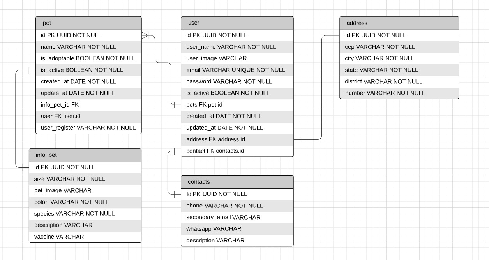

# Documentação da API

## Tabela de Conteúdos

- [Documentação da API](#documentação-da-api)
  - [Tabela de Conteúdos](#tabela-de-conteúdos)
  - [1. Visão Geral](#1-visão-geral)
  - [2. Diagrama ER](#2-diagrama-er)
  - [3. Início Rápido](#3-início-rápido)
    - [3.1. Instalando Dependências](#31-instalando-dependências)
    - [3.2. Variáveis de Ambiente](#32-variáveis-de-ambiente)
    - [3.3. Migrations](#33-migrations)
  - [4. Autenticação](#4-autenticação)
  - [5. Endpoints](#5-endpoints)
    - [Índice](#índice)
  - [1. **Users**](#1-users)
    - [Endpoints](#endpoints)
    - [1.1. **Criação de Usuário**](#11-criação-de-usuário)
    - [`/users`](#users)
    - [Exemplo de Request:](#exemplo-de-request)
    - [Corpo da Requisição:](#corpo-da-requisição)
    - [Schema de Validação com Yup:](#schema-de-validação-com-yup)
    - [Exemplo de Response:](#exemplo-de-response)
    - [Possíveis Erros:](#possíveis-erros)
    - [1.2. **Login do usuário**](#12-login-do-usuário)
    - [Exemplo de Request:](#exemplo-de-request-1)
    - [Corpo da Requisição:](#corpo-da-requisição-1)
    - [Exemplo de Response:](#exemplo-de-response-1)
    - [Possíveis Erros:](#possíveis-erros-1)
    - [1.3. **Listando Usuários**](#13-listando-usuários)
    - [`/users`](#users-1)
    - [Exemplo de Request:](#exemplo-de-request-2)
    - [Corpo da Requisição:](#corpo-da-requisição-2)
    - [Exemplo de Response:](#exemplo-de-response-2)
    - [Possíveis Erros:](#possíveis-erros-2)
    - [1.4. **Atualização do usuário**](#14-atualização-do-usuário)
    - [`/users`](#users-2)
    - [Exemplo de Request:](#exemplo-de-request-3)
    - [Corpo da Requisição:](#corpo-da-requisição-3)
    - [Exemplo de Response:](#exemplo-de-response-3)
    - [Possíveis Erros:](#possíveis-erros-3)
    - [1.4. **SoftDelete do usuário**](#14-softdelete-do-usuário)
    - [`/users`](#users-3)
    - [Exemplo de Request:](#exemplo-de-request-4)
    - [Corpo da Requisição:](#corpo-da-requisição-4)
    - [Exemplo de Response:](#exemplo-de-response-4)
    - [Possíveis Erros:](#possíveis-erros-4)

---

## 1. Visão Geral

Visão geral do projeto, um pouco das tecnologias usadas.

- [NodeJS](https://nodejs.org/en/)
- [Express](https://expressjs.com/pt-br/)
- [TypeScript](https://www.typescriptlang.org/)
- [PostgreSQL](https://www.postgresql.org/)
- [TypeORM](https://typeorm.io/)
- [Yup](https://www.npmjs.com/package/yup)

A URL base da aplicação:
https://mais-que-um-pet.herokuapp.com

---

## 2. Diagrama ER

[ Voltar para o topo ](#tabela-de-conteúdos)

Diagrama ER da API definindo bem as relações entre as tabelas do banco de dados.



---

## 3. Início Rápido

[ Voltar para o topo ](#tabela-de-conteúdos)

### 3.1. Instalando Dependências

Clone o projeto em sua máquina e instale as dependências com o comando:

```shell
yarn
```

### 3.2. Variáveis de Ambiente

Em seguida, crie um arquivo **.env**, copiando o formato do arquivo **.env.example**:

```
cp .env.example .env
```

Configure suas variáveis de ambiente com suas credenciais do Postgres e uma nova database da sua escolha.

### 3.3. Migrations

Execute as migrations com o comando:

```
yarn typeorm migration:run -d src/database/data-source.ts
```

---

## 4. Autenticação

[ Voltar para o topo ](#tabela-de-conteúdos)

```
Authorization: Bearer token
```

---

## 5. Endpoints

[ Voltar para o topo ](#tabela-de-conteúdos)

### Índice

- [Users](#1-users)
  - [POST - /users](#11-criação-de-usuário)
  - [GET - /users](#12-listando-usuários)
  - [GET - /users/:user_id](#13-listar-usuário-por-id)
- [Pets](#2-pets)
  - [POST - /pets](#21-criação-de-pet)
  - [GET - /pets](#22-listando-pets)

---

## 1. **Users**

[ Voltar para os Endpoints ](#5-endpoints)

O objeto User é definido como:

| Campo      | Tipo    | Descrição                                  |
| ---------- | ------- | ------------------------------------------ |
| id         | string  | Identificador único do usuário             |
| user_name  | string  | O nome do usuário.                         |
| user_image | string  | Url da imagem do perfil do usuário         |
| email      | string  | O e-mail do usuário.                       |
| password   | string  | A senha de acesso do usuário               |
| is_active  | Boolean | Informa se a conta está ativa              |
| pets       | Array   | Array de pets do usuário                   |
| created_at | date    | Data de cadastro do usuário                |
| updated_at | date    | Data de atualização do perfil do usuário   |
| address    | Address | Objeto Address, define endereço do usuário |
| contact    | Contact | Objeto Contact, define contatos do usuário |

### Endpoints

| Método | Rota       | Descrição                 |
| ------ | ---------- | ------------------------- |
| POST   | /users     | Criação de um usuário.    |
| POST   | /login     | Login do usuário.         |
| GET    | /users     | Lista todos os usuários   |
| PATCH  | /users/:id | Atualiza dados do usuário |
| DELETE | /users/:id | SoftDelete do usuário     |

---

### 1.1. **Criação de Usuário**

[ Voltar para os Endpoints ](#5-endpoints)

### `/users`

### Exemplo de Request:

```
POST /users
Host: https://mais-que-um-pet.herokuapp.com
Authorization: None
Content-type: application/json
```

### Corpo da Requisição:

```json
{
  "user_name": "Makson",
  "user_image": "url_image",
  "email": "makson@mail.com",
  "password": "1234",
  "address": {
    "cep": "12345678",
    "city": "Recife",
    "district": "Nova Decoberta",
    "number": "10",
    "state": "PE"
  },
  "contact": {
    "description": "",
    "phone": "81991919191",
    "secondary_email": "makson2@mail.com",
    "whatsapp": "81993939393"
  }
}
```

### Schema de Validação com Yup:

```javascript
user_name: yup.string().required(),
  user_image: yup
    .string()
    .notRequired()
    .default(() => ""),
  email: yup
    .string()
    .email()
    .required()
    .transform((value: string, originalValue: string) => {
      return originalValue.toLowerCase();
    }),
  password: yup
    .string()
    .required()
    .transform((value: string, originalValue: string) => {
      return bcrypt.hashSync(originalValue, 10);
    }),
  address: yup.object().shape({
    cep: yup.string().required(),
    city: yup.string().required(),
    district: yup.string().required(),
    number: yup.string().required(),
    state: yup.string().required(),
  }),
  contact: yup.object().shape({
    description: yup
      .string()
      .notRequired()
      .default(() => ""),
    phone: yup
      .string()
      .notRequired()
      .default(() => ""),
    secondary_email: yup
      .string()
      .notRequired()
      .default(() => ""),
    whatsapp: yup
      .string()
      .notRequired()
      .default(() => "")
```

OBS.: Chaves não presentes no schema serão removidas.

### Exemplo de Response:

```
201 Created
```

```json
{
  "id": "22f55f79-0a33-4af5-b7fb-f20e41c1ceed",
  "user_name": "Makson",
  "user_image": "jubfjsdbds",
  "email": "azevedo@mail.com",
  "is_active": true,
  "address": {
    "cep": "12345678",
    "city": "Recife",
    "district": "Nova Decoberta",
    "number": "10",
    "state": "PE",
    "id": "dd032196-339a-4a20-a7ee-8c5c72f17611"
  },
  "contact": {
    "description": "uma breve descrição",
    "phone": "81991919191",
    "secondary_email": "makson2@mail.com",
    "whatsapp": "81993939393",
    "id": "8a3cfb25-3f75-4534-8d8f-cc736aa9a690"
  },
  "pets": [],
  "created_at": "2022-11-04T16:13:46.493Z",
  "updated_at": "2022-11-04T16:13:46.493Z"
}
```

### Possíveis Erros:

| Código do Erro  | Descrição             |
| --------------- | --------------------- |
| 400 Bad request | Email already exists. |

---

### 1.2. **Login do usuário**

[ Voltar aos Endpoints ](#5-endpoints)

### Exemplo de Request:

```
POST /login
Host: https://mais-que-um-pet.herokuapp.com
Authorization: None
Content-type: application/json
```

### Corpo da Requisição:

```json
{
  "email": "makson@mail.com",
  "password": "1234"
}
```

### Exemplo de Response:

```
200 OK
```

```json
[
  {
    "token": "token-de-login"
  }
]
```

### Possíveis Erros:

| Código do Erro    | Descrição                   |
| ----------------- | --------------------------- |
| 400 Bad request   | email/password is required. |
| 403 Bad forbidden | Wrong email/password.       |

---

### 1.3. **Listando Usuários**

[ Voltar aos Endpoints ](#5-endpoints)

### `/users`

### Exemplo de Request:

```

GET /users
Host: https://mais-que-um-pet.herokuapp.com
Authorization: None
Content-type: application/json

```

### Corpo da Requisição:

```json
Vazio
```

### Exemplo de Response:

```
200 OK
```

```json
[
  {
    "id": "22f55f79-0a33-4af5-b7fb-f20e41c1ceed",
    "user_name": "Makson",
    "user_image": "jubfjsdbds",
    "email": "azevedo@mail.com",
    "is_active": true,
    "address": {
      "cep": "12345678",
      "city": "Recife",
      "district": "Nova Decoberta",
      "number": "10",
      "state": "PE",
      "id": "dd032196-339a-4a20-a7ee-8c5c72f17611"
    },
    "contact": {
      "description": "uma breve descrição",
      "phone": "81991919191",
      "secondary_email": "makson2@mail.com",
      "whatsapp": "81993939393",
      "id": "8a3cfb25-3f75-4534-8d8f-cc736aa9a690"
    },
    "pets": [],
    "created_at": "2022-11-04T16:13:46.493Z",
    "updated_at": "2022-11-04T16:13:46.493Z"
  }
]
```

### Possíveis Erros:

Nenhum, o máximo que pode acontecer é retornar uma lista vazia.

---

### 1.4. **Atualização do usuário**

[ Voltar aos Endpoints ](#5-endpoints)

### `/users`

```
Só pode ser atualizado o user_name, user_image, email e password.
```

### Exemplo de Request:

```

PATCH /users/:id
Host: https://mais-que-um-pet.herokuapp.com
Authorization: Bearer token
Content-type: application/json

```

### Corpo da Requisição:

```json
{
  "user_name": "João",
  "user_image": "url_da_imagem",
  "email": "joao@mail.com",
  "password": "12345"
}
```

### Exemplo de Response:

```
200 OK
```

```json
{
  "message": "User updated!",
  "updatedUser": {
    "id": "22f55f79-0a33-4af5-b7fb-f20e41c1ceed",
    "user_image": "url_da_imagem",
    "user_name": "João",
    "email": "joao@mail.com",
    "password": "$2b$10$3dmTSKOWBQp4zPp./VmQ7uKVsuWvlhFTQTkPJLmloAvF64POC9gDu",
    "is_active": true,
    "created_at": "2022-11-04T16:13:46.493Z",
    "updated_at": "2022-11-07T14:24:20.584Z",
    "pets": [],
    "address": {
      "id": "dd032196-339a-4a20-a7ee-8c5c72f17611",
      "cep": "12345678",
      "city": "Recife",
      "state": "PE",
      "district": "Nova Decoberta",
      "number": "10"
    },
    "contact": {
      "id": "8a3cfb25-3f75-4534-8d8f-cc736aa9a690",
      "phone": "81991919191",
      "secondary_email": "makson2@mail.com",
      "whatsapp": "81993939393",
      "description": "uma breve descrição"
    }
  }
}
```

### Possíveis Erros:

| Código do Erro   | Descrição                             |
| ---------------- | ------------------------------------- |
| 400 Bad request  | missing authorization token..         |
| 403 forbidden    | Invalid token.                        |
| 401 unauthorized | Is not able to update isActive value. |
| 401 unauthorized | Is not able to update id.             |
| 404 not found    | User not found.                       |

---

### 1.4. **SoftDelete do usuário**

[ Voltar aos Endpoints ](#5-endpoints)

### `/users`

### Exemplo de Request:

```

DELETE /users/:id
Host: https://mais-que-um-pet.herokuapp.com
Authorization: Bearer token
Content-type: application/json

```

### Corpo da Requisição:

```json
Vazio
```

### Exemplo de Response:

```
204 OK
```

```json
Vazio
```

### Possíveis Erros:

| Código do Erro    | Descrição                     |
| ----------------- | ----------------------------- |
| 400 Bad request   | missing authorization token.. |
| 403 Bad forbidden | Invalid token.                |
| 400 not found     | User not found.               |
| 401 unauthorized  | User is not active.           |

---
